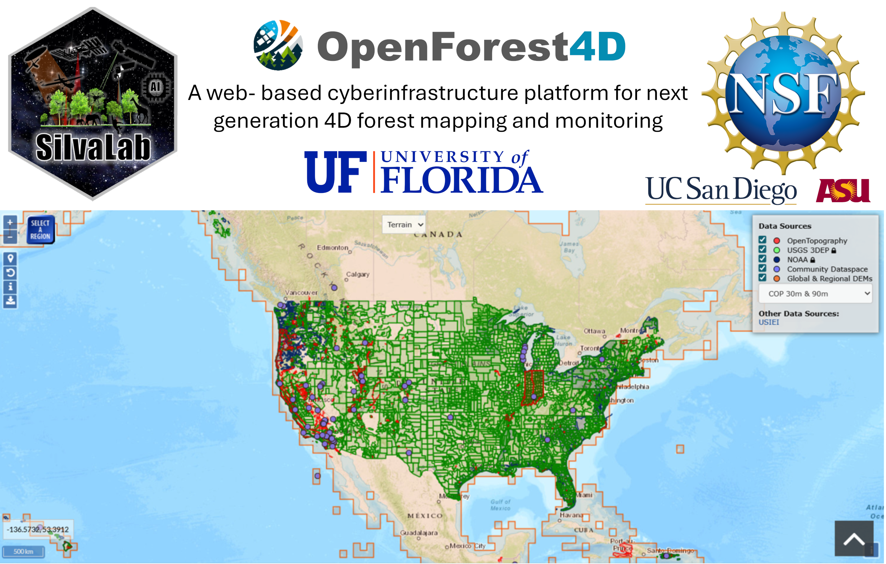

# ALS downloader Shiny app

A Shiny application for discovering and downloading USGS 3DEP ALS (LiDAR) LAZ data
available through OpenTopography.

🔗 USGS 3DEP datasets on OpenTopography:  
https://portal.opentopography.org/datasets

## User Interface



## Access

🔗 Online demo (search & availability only)

https://d1kw4k-cesar0ivan-alvites0diaz.shinyapps.io/lidar_app/

## Overview

ALS downloader is a Shiny-based application designed to search, explore, and download Airborne Laser Scanning (ALS / LiDAR) data from the USGS 3DEP program.

The application allows users to define a study area (AOI), identify ALS tile availability across years and projects, and download selected LAZ tiles locally, leveraging multi-core parallel processing.

⚠️ Important

Due to cloud execution constraints, parallel downloads are only available when running the app locally.
The hosted Shiny version is intended only for data discovery and availability assessment.

## Application Architecture

The interface is organized into the following functional components (see Figure below):

A) Study Area Input (AOI)
B) Local Processing Configuration
C) Output Configuration
D) LiDAR Tile Discovery
E) ALS Data Download
F) Application Header and Project Context


## Purpose and Use Cases

ALS downloader is designed to support:

- ALS data availability assessment for forest, environmental, and geomatics studies

- Efficient local data acquisition for large AOIs using multi-core CPUs

- The app is not intended for point cloud processing or visualization, but rather for data discovery and acquisition.


## Opportunities and Challenges

The **ALS downloader** provides similar core opportunities in both **online** and **local** execution modes.  
However, the **challenges (limitations)** differ depending on the execution environment.

### Opportunities (common to Online and Local versions)

| Opportunity | Description |
|------------|-------------|
| ALS availability assessment | Identify USGS 3DEP ALS data intersecting a user-defined AOI |
| Metadata exploration | Inspect available acquisition years, project sources, and tile counts |
| Spatial coverage understanding | Understand the spatial distribution of ALS data within the AOI |
| Data acquisition planning | Support informed planning prior to large-scale data downloads |
| Reproducible workflows | Enable consistent AOI-based data discovery across environments |

---

### Challenges / Limitations (by execution mode)

| Execution Mode | Challenges / Limitations |
|---------------|--------------------------|
| **Online (Shiny deployment)** | No parallel downloads;<br>Limited execution time;<br>Not suitable for large-scale LAZ downloads;<br>Restricted access to local file system |
| **Local (desktop execution)** | Download performance depends on local hardware;<br>Parallelization limited by available CPU cores;<br>Requires local setup (R environment and dependencies);<br>Requires sufficient disk space and network bandwidth |

---

**Summary**

➡️ **Online execution** is best suited for exploring ALS availability and planning data acquisition.  
➡️ **Local execution** is recommended for efficient, large-scale ALS (LAZ) downloads and operational workflows.

## How to Configure the App Locally (Recommended for Downloading ALS Data)

To fully leverage the application, users should run it locally.

### Step 1 – Download the Application

- Download the repository as a ZIP file
- Unzip it on your local machine

### Step 2 – Open the Project

- Open the project folder in RStudio
- Ensure required R packages are installed (as listed in the project documentation)

### Step 3 – Run the Application

```r
# ============================
# Run lidar_app locally
# ============================

# Set the working directory to the application folder
# Replace the path below with the location where you unzipped the project
setwd("path/to/lidar_app")

# Verify that the app files are present
list.files()

# Run the Shiny application
shiny::runApp("app.R")

# The app will now have access to your local CPU resources
```

## Workflow Tutorial

This section describes the **step-by-step workflow** for discovering and downloading
USGS 3DEP ALS (LiDAR) data using `lidar_app`.  
The workflow guides users from **AOI definition** to **local LAZ data acquisition**.

---

### 1. Study Area Input (AOI)

Users define the Area of Interest by uploading one of the following formats:

- a zipped Shapefile
- a GeoPackage (`.gpkg`)
- a GeoJSON file

If multiple polygons are present, users can select one or more features
based on attribute values.

---

### 2. Local Processing Configuration

This step controls download performance:

- users specify the number of CPU cores to be used
- parallel downloads significantly reduce acquisition time for large AOIs

⚠️ This option is effective **only when running the app locally**.

---

### 3. Output Configuration

Users define:

- the output directory on their local machine
- the project folder name

Downloaded LAZ files are automatically organized in a structured
folder hierarchy to support reproducible workflows.

---

### 4. LiDAR Tile Discovery

After configuring the AOI:

- the app queries USGS 3DEP ALS metadata services
- ALS tiles intersecting the AOI are identified

Results are summarized by:

- acquisition year
- project/source
- number of available tiles

This step allows users to evaluate ALS availability before downloading data.

---

### 5. ALS Data Download

Users can:

- select specific acquisition years
- select specific ALS projects
- download only the required LAZ tiles

Downloaded files are saved locally and can be directly used in:

- PDAL
- lidR
- CloudCompare
- GIS software

## Developers and Maintainers

- Cesar Alvites — University of Florida  
- Carlos Alberto Silva — University of Florida  
- Viswanath Nandigam — San Diego Supercomputer Center, University of California San Diego  
- Chelsea Scott — Arizona State University  
- Inacio Bueno — University of Florida

## Acknowledgements

This application was developed within the OpenForest4D (https://openforest4d.org/) cyberinfrastructure initiative, supported by academic and research institutions focused on next-generation forest mapping and monitoring.
